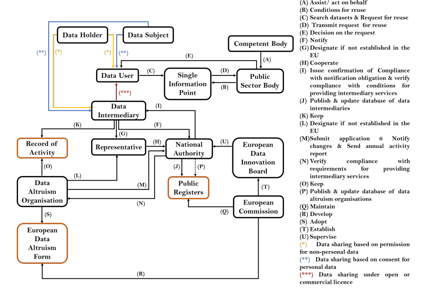

# DGAterms - A vocabulary to describe information flows in the Data Governance Act (DGA)

Following the impact of the GDPR on the regulation of the use of personal data of European citizens, the European Commission is now focused on implementing a common data strategy to promote the (re)use and sharing of data between citizens, companies and governments while maintaining it under the control of the entities that generated it. In this context, the Data Governance Act (DGA), along with the proposed visions for Data Spaces and Data Act, emphasizes the altruistic reuse of data and the emergence of data intermediaries as trusted entities that do not have an interest in analysing the data itself and act only as enablers of the sharing of data between data holders and data users.

In particular, in order to address DGA's new requirements, this work investigates how to apply Semantic Web vocabularies, such as the W3C's [Data Privacy Vocabulary (DPV)](https://w3id.org/dpv), [Open Digital Rights Language (ODRL)](https://www.w3.org/TR/odrl-model/) or [Data Catalog Vocabulary (DCAT)](https://www.w3.org/TR/vocab-dcat-2/), to 

(1) generate machine-readable policies for the reuse of public data, 

(2) specify data altruism consent terms and 

(3) create uniform registries of data altruism organisations and intermediation services' providers 

as the usage of such technologies promotes machine readability and interoperability. In addition, the use of open semantic vocabularies eases the comparison of data-sharing policies across different use cases and thereby accelerates the development and sharing of best practices for the European altruistic and trusted data intermediary sectors.

This work is under review at the [16th International Conference on Computers, Privacy & Data Protection](https://www.cpdpconferences.org/).

## Repository Contents

The repository contains the following work:

- [`./doc`](./DUO) folder contains the HTML documentation generated for the developed vocabulary
- [`./vocabulary-terms`](./vocabulary-terms) contains two spreadsheets with the vocabulary's classes and properties
- [`./examples`](./examples) contains a list of RDF examples that use DGAterms to specify ODRL policies, registries of activities, SPARQL queries and more

-----------------------
Work developed by:
Anonymous